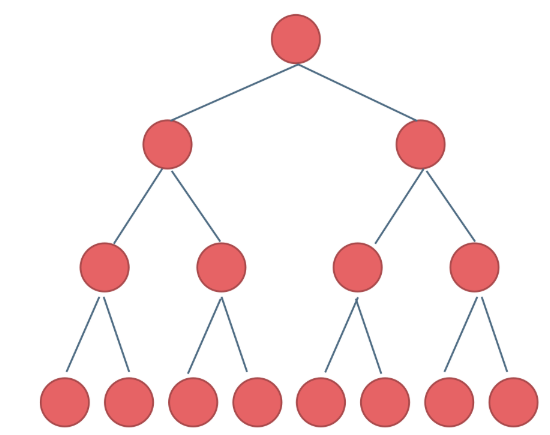
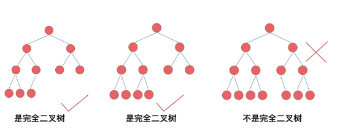
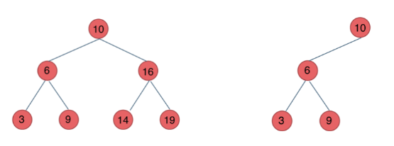
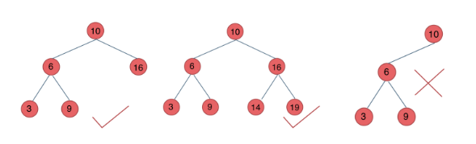
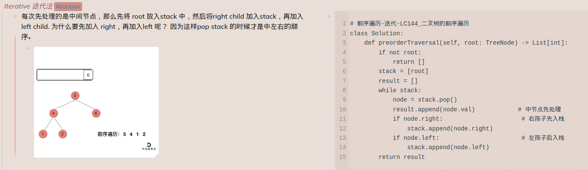
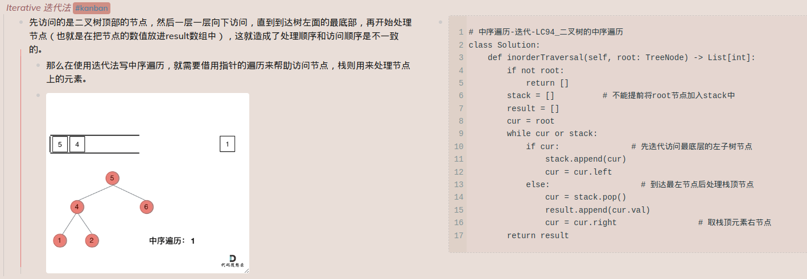
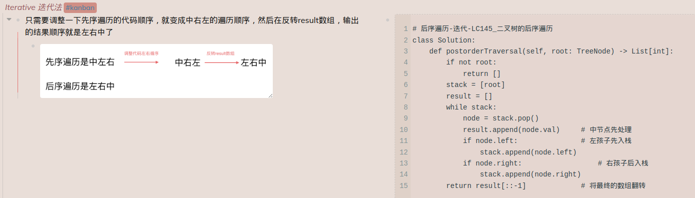

#### 二叉树理论基础篇
文章讲解：https://programmercarl.com/%E4%BA%8C%E5%8F%89%E6%A0%91%E7%90%86%E8%AE%BA%E5%9F%BA%E7%A1%80.html  

二叉树的种类：
* **满二叉树 (Full Binary Tree)**
  * Each node is either a leaf node (degree 0) or has exactly two children (degree 2)
  * All leaf nodes are at the same depth (or level). 也就是没有 missing leaves
  * 深度为k，有2^k-1个节点的二叉树。
  * 
* **完全二叉树 （Complete Binary Tree）**
  * All levels except the last are fully filled.
  * 最下面一层的节点都集中在该层最左边的若干位置
  * Heap 就是一个 complete binary tree
  * 
* **二叉搜索树 (Binary Search Tree)**
  * 有数值的，是一个有序树
  * 若它的左子树不空，则左子树上所有结点的值均小于它的根结点的值
  * 若它的右子树不空，则右子树上所有结点的值均大于它的根结点的值
  * 它的左、右子树也分别为二叉排序树
  * 
* **平衡二叉搜索树 (AVL tree)**
  * 是一棵空树或它的左右两个子树的高度差的绝对值不超过1
  * 左右两个子树都是一棵平衡二叉树
  *   

**二叉树的存储方式**
* 链式储存
  * 通过指针把分布在各个地址的节点串联一起
* 顺序储存
  * 元素在内存是连续分布的
  * 用数组储存二叉树
  * 如果父节点的数组下标是 i，那么它的左孩子就是 i * 2 + 1，右孩子就是 i * 2 + 2。

BFS 一般使用Queue来实现，这也是Queue FIFO 的特点所决定的，因为需要先进先出的结构，才能一层一层的来遍历二叉树
Stack其实就是 recursion 的一种实现结构，也就说前中后序遍历的逻辑其实都是可以借助stack 使用recursion的方式来实现的。

#### 二叉树的递归遍历
题目链接/文章讲解/视频讲解：https://programmercarl.com/%E4%BA%8C%E5%8F%89%E6%A0%91%E7%9A%84%E9%80%92%E5%BD%92%E9%81%8D%E5%8E%86.html  

递归的实现就是：每一次递归调用都会把函数的局部变量、参数值和返回地址等压入调用栈中，然后递归返回的时候，从栈顶弹出上一次递归的各项参数，所以这就是递归为什么可以返回上一层位置的原因。

递归三要素：
  1. *确定递归函数的参数和返回值：* 确定哪些参数是递归的过程中需要处理的，那么就在递归函数里加上这个参数， 并且还要明确每次递归的返回值是什么进而确定递归函数的返回类型。
  2. *确定终止条件：* 写完了递归算法, 运行的时候，经常会遇到栈溢出的错误，就是没写终止条件或者终止条件写的不对，操作系统也是用一个栈的结构来保存每一层递归的信息，如果递归没有终止，操作系统的内存栈必然就会溢出。
  3. *确定单层递归的逻辑*： 确定每一层递归需要处理的信息。在这里也就会重复调用自己来实现递归的过程。

#### 二叉树的迭代遍历
题目链接/文章讲解/视频讲解：https://programmercarl.com/%E4%BA%8C%E5%8F%89%E6%A0%91%E7%9A%84%E8%BF%AD%E4%BB%A3%E9%81%8D%E5%8E%86.html  

**Preorder**


**Inorder**


**Postorder**


#### 二叉树的统一迭代法
题目链接/文章讲解：https://programmercarl.com/%E4%BA%8C%E5%8F%89%E6%A0%91%E7%9A%84%E7%BB%9F%E4%B8%80%E8%BF%AD%E4%BB%A3%E6%B3%95.html 


Preorder
```
class Solution:
    def preorderTraversal(self, root: TreeNode) -> List[int]:
        result = []
        st= []
        if root:
            st.append(root)
        while st:
            node = st.pop()
            if node != None:
                if node.right: #右
                    st.append(node.right)
                if node.left: #左
                    st.append(node.left)
                st.append(node) #中
                st.append(None)
            else:
                node = st.pop()
                result.append(node.val)
        return result
```

Inorder
```
class Solution:
    def inorderTraversal(self, root: TreeNode) -> List[int]:
        result = []
        st = []
        if root:
            st.append(root)
        while st:
            node = st.pop()
            if node != None:
                if node.right: #添加右节点（空节点不入栈）
                    st.append(node.right)
                
                st.append(node) #添加中节点
                st.append(None) #中节点访问过，但是还没有处理，加入空节点做为标记。
                
                if node.left: #添加左节点（空节点不入栈）
                    st.append(node.left)
            else: #只有遇到空节点的时候，才将下一个节点放进结果集
                node = st.pop() #重新取出栈中元素
                result.append(node.val) #加入到结果集
        return result
```

Postorder
```
class Solution:
    def postorderTraversal(self, root: TreeNode) -> List[int]:
        result = []
        st = []
        if root:
            st.append(root)
        while st:
            node = st.pop()
            if node != None:
                st.append(node) #中
                st.append(None)
                
                if node.right: #右
                    st.append(node.right)
                if node.left: #左
                    st.append(node.left)
            else:
                node = st.pop()
                result.append(node.val)
        return result
```

#### 二叉树层序遍历
题目链接/文章讲解/视频讲解：https://programmercarl.com/0102.%E4%BA%8C%E5%8F%89%E6%A0%91%E7%9A%84%E5%B1%82%E5%BA%8F%E9%81%8D%E5%8E%86.html
  
```
# 利用长度法
# Definition for a binary tree node.
# class TreeNode:
#     def __init__(self, val=0, left=None, right=None):
#         self.val = val
#         self.left = left
#         self.right = right
class Solution:
    def levelOrder(self, root: Optional[TreeNode]) -> List[List[int]]:
        if not root:
            return []
        queue = collections.deque([root])
        result = []
        while queue:
            level = []
            for _ in range(len(queue)):
                cur = queue.popleft()
                level.append(cur.val)
                if cur.left:
                    queue.append(cur.left)
                if cur.right:
                    queue.append(cur.right)
            result.append(level)
        return result
```

```
#递归法
# Definition for a binary tree node.
# class TreeNode:
#     def __init__(self, val=0, left=None, right=None):
#         self.val = val
#         self.left = left
#         self.right = right
class Solution:
    def levelOrder(self, root: Optional[TreeNode]) -> List[List[int]]:
        if not root:
            return []

        levels = []

        def traverse(node, level):
            if not node:
                return

            if len(levels) == level:
                levels.append([])

            levels[level].append(node.val)
            traverse(node.left, level + 1)
            traverse(node.right, level + 1)

        traverse(root, 0)
        return levels

```