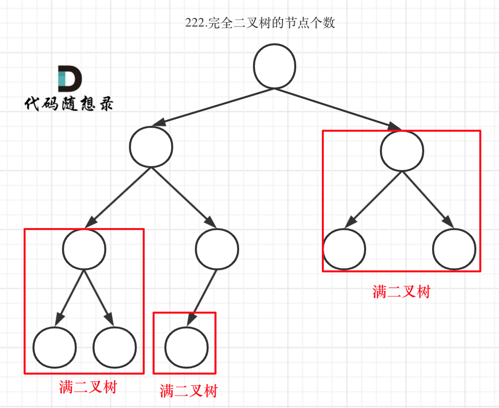

#### [110. Balanced Binary Tree](https://leetcode.com/problems/balanced-binary-tree/description/) - 重做
题目链接/文章讲解/视频讲解：https://programmercarl.com/0110.%E5%B9%B3%E8%A1%A1%E4%BA%8C%E5%8F%89%E6%A0%91.html  

这题求的是left subtree & right subtree 的高度，所以用后序遍历（左右孩子返回给父节点）。
终止条件：当 not node的时候
递归逻辑：分别求出左右子树的高度，如果差值大于1,那就返回-1；如果小于等于 1，那就可以返回目前的高度
    - 得出高度是通过 max(left, right) + 1 

#### [257. Binary Tree Paths](https://leetcode.com/problems/binary-tree-paths/description/) - 重做
题目链接/文章讲解/视频讲解：https://programmercarl.com/0257.%E4%BA%8C%E5%8F%89%E6%A0%91%E7%9A%84%E6%89%80%E6%9C%89%E8%B7%AF%E5%BE%84.html 

方法一 (iterative):
- 这题可以用 queue 来做，只不过需要储存 tuple (node, str_val) 到 queue 里面。需要注意的是 deque([(...,...)]), deque 里面的 list 来储存 tuple, 而不是两个元素在 list 里面

方法二 (recursive)：
- 用前序遍历 （按照要求从上往下，父节点指向孩子节点 ）+回溯算法（到了left node，把节点弹出来，回溯重新把别的孩子加进来）
- 终止条件：当到了 leaf node 的时候，就是收获结果的时候 - result 就把 path 加进去 
- 处理过程：每遍历一个节点，就把节点加入 path。遍历中节点的时候需要写在终止条件前面，不然就会忽略到 leaf node
  - 遍历左孩子，最后pop（回溯）
  - 遍历右孩子，最后pop（回溯）

#### [404. Sum of Left Leaves](https://leetcode.com/problems/sum-of-left-leaves/description/)
题目链接/文章讲解/视频讲解：https://programmercarl.com/0404.%E5%B7%A6%E5%8F%B6%E5%AD%90%E4%B9%8B%E5%92%8C.html  

这道题一定需要通过父节点来判断其左孩子节点是否就是我们想要找的节点，所以就不能遍历到 leaf node, 而是只能遍历到 leaf node 上面的那一层。
用后序遍历比较适合，因为是从孩子那里收集到的左叶子之和返回给父节点
遍历逻辑：
  - 遇到空节点，返回0
  - 遇到叶子节点， 返回0 （因为不知道这个叶子是否是我们需要的左节点）
  - 统计 left subtree 的左孩子之和
  - 统计 right subtree的左孩子之和

#### [222. Count Complete Tree Nodes](https://leetcode.com/problems/count-complete-tree-nodes/description/) - 用完全二叉树的特性重做
题目链接/文章讲解/视频讲解：https://programmercarl.com/0222.%E5%AE%8C%E5%85%A8%E4%BA%8C%E5%8F%89%E6%A0%91%E7%9A%84%E8%8A%82%E7%82%B9%E4%B8%AA%E6%95%B0.html  

因为这道题强调了它是一个完全二叉树，我们就需要利用这个特性 - leaf nodes 是从左到右一字排开的，不断开
这题如果知道了一个 subtree 是完全二叉树和它的深度，就可以套用公式计算。因为题目的条件，只要我们一直往下递归，一定可以找到一个满二叉树条件的节点，至少叶子节点是一个满二叉树。
如何判断 subtree 是否满二叉树呢？-> 计算 left subtree & right subtree 的深度是否相同
终止条件：如果 subtree 是完全二叉树 / 节点为 Null

完全二叉树只有两种情况，情况一：就是满二叉树，情况二：最后一层叶子节点没有满。
- 对于情况一，可以直接用 2^树深度 - 1 来计算，注意这里根节点深度为1。
- 对于情况二，分别递归左孩子，和右孩子，递归到某一深度一定会有左孩子或者右孩子为满二叉树，然后依然可以按照情况1来计算。
- 
- 