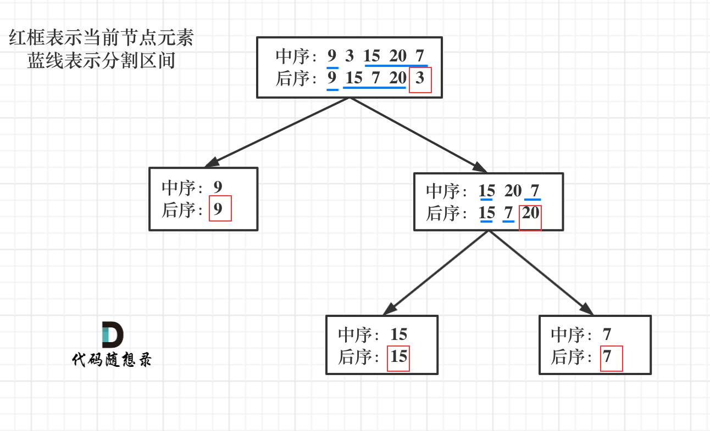

#### [513. Find Bottom Left Tree Value](https://leetcode.com/problems/find-bottom-left-tree-value/description/)
题目链接/文章讲解/视频讲解：https://programmercarl.com/0513.%E6%89%BE%E6%A0%91%E5%B7%A6%E4%B8%8B%E8%A7%92%E7%9A%84%E5%80%BC.html  

二刷需要学会 recursive method.
这题用 iterative method 来做还算是比较简单的，只可惜一开始没想出来。注意题目需要找的是 leftmost value, 只是一个数，我看错题目以外是左边的所有数字，导致花多了时间。如果想要找到最左的元素，只需要用 queue, 然后把 res 设定为每个 queue 开头的元素，到了最后就能找到最左边的元素了。

#### [112. Path Sum](https://leetcode.com/problems/path-sum/description/)
题目链接/文章讲解/视频讲解：https://programmercarl.com/0112.%E8%B7%AF%E5%BE%84%E6%80%BB%E5%92%8C.html  

这道题的遍历前中后顺序都可以，因为没有中点的处理逻辑。这道题中也其实没有必要遍历左右节点，只要找到一条路径符合条件，就可以直接返回 True

1. 确定递归参数：
   1. 二叉树根节点，计数器来计算这一条是否正好是目标之和
2. 终止条件：
   1. 遇到叶子节点（左右为空） - 注意是叶子节点而不是空节点，并且 count 一路减下来变为 0，那就可以判断目前这条路径是否符合
3. 单层遍历逻辑：
   1. 因为终止条件是判断叶子节点，所以递归的过程中就不要让空节点进入递归了。
   2. 如果找到合适路径，立即返回 True
   3. 每一层都需要放入 count -= node.left.val

**递归函数什么时候需要返回值？什么时候不需要返回值？这里总结如下三点：**

- 如果需要搜索整棵二叉树且不用处理递归返回值，递归函数就不要返回值。（这种情况就是本文下半部分介绍的113.路径总和ii）
- 如果需要搜索整棵二叉树且需要处理递归返回值，递归函数就需要返回值。 （这种情况我们在236. 二叉树的最近公共祖先 (opens new window)中介绍）
- 如果要搜索其中一条符合条件的路径，那么递归一定需要返回值，因为遇到符合条件的路径了就要及时返回。（本题的情况）

#### [113. Path Sum II](https://leetcode.com/problems/path-sum-ii/description/) - 重做
题目链接/文章讲解/视频讲解：https://programmercarl.com/0112.%E8%B7%AF%E5%BE%84%E6%80%BB%E5%92%8C.html  

这题我用了迭代法来做， 主要是创建的 queue 需要同时记录着目前的 node 和 path， 然后在 iterate 的过程中把新的 node 加入知道遇到 leaf node
递归：
- 要遍历整个树，找到所有路径，所以递归函数不要返回值
- `res.append(list(path))` 是因为需要 create a copy of the path, 不然下次更改 path 会把已经加进去的 path 也更改掉了
- 这题感觉还是比较难的，主要还搞不懂为什么在返回值后不需要 count += node.val

#### [106. Construct Binary Tree from Inorder and Postorder Traversal](https://leetcode.com/problems/construct-binary-tree-from-inorder-and-postorder-traversal/description/)
题目链接/文章讲解/视频讲解：https://programmercarl.com/0106.%E4%BB%8E%E4%B8%AD%E5%BA%8F%E4%B8%8E%E5%90%8E%E5%BA%8F%E9%81%8D%E5%8E%86%E5%BA%8F%E5%88%97%E6%9E%84%E9%80%A0%E4%BA%8C%E5%8F%89%E6%A0%91.html 

第一步：如果数组大小为零的话，说明是空节点了。
第二步：如果不为空，那么取后序数组最后一个元素作为节点元素。
第三步：找到后序数组最后一个元素在中序数组的位置，作为切割点
第四步：切割中序数组，切成中序左数组和中序右数组 （顺序别搞反了，一定是先切中序数组）
第五步：切割后序数组，切成后序左数组和后序右数组
第六步：递归处理左区间和右区间

注意：
`inorder_left = inorder[::root_index]  # Incorrect slicing` 因为是 start,stop,step

#### [105. Construct Binary Tree from Preorder and Inorder Traversal](https://leetcode.com/problems/construct-binary-tree-from-preorder-and-inorder-traversal/description/)
题目链接/文章讲解/视频讲解：https://programmercarl.com/0106.%E4%BB%8E%E4%B8%AD%E5%BA%8F%E4%B8%8E%E5%90%8E%E5%BA%8F%E9%81%8D%E5%8E%86%E5%BA%8F%E5%88%97%E6%9E%84%E9%80%A0%E4%BA%8C%E5%8F%89%E6%A0%91.html 

这道题与上面 106 这道题非常类似。难点在于下一个 preorder 的区间会在哪里