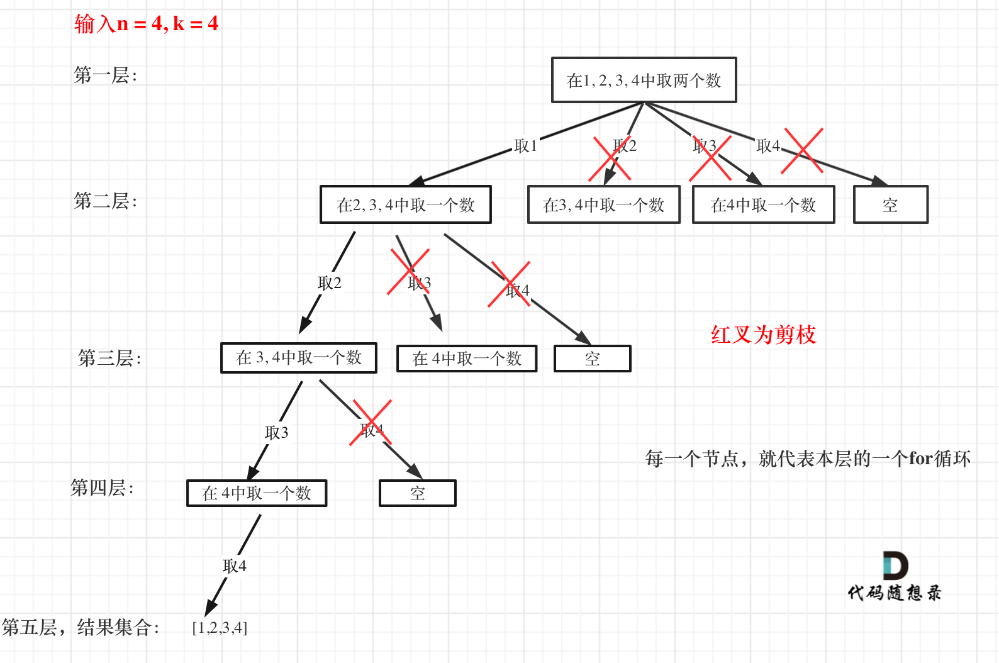

#### 回溯算法基础理论
题目链接/文章讲解：https://programmercarl.com/%E5%9B%9E%E6%BA%AF%E7%AE%97%E6%B3%95%E7%90%86%E8%AE%BA%E5%9F%BA%E7%A1%80.html  
视频讲解：https://www.bilibili.com/video/BV1cy4y167mM  

#### [77. Combinations](https://leetcode.com/problems/combinations/description/)
题目链接/文章讲解：https://programmercarl.com/0077.%E7%BB%84%E5%90%88.html   
视频讲解：https://www.bilibili.com/video/BV1ti4y1L7cv 
剪枝操作：https://www.bilibili.com/video/BV1wi4y157er   

太好了！这题我凭借着自己的想法做出来了！

需要注意的是：
- 与 Day16. 113 题一样，在储存 list 的时候需要储存这个 list 的 copy， `res.append(list(bracket))` 不然回溯后 bracket 会更改，res也会随着更改。

组合是无序的，{1,2} & {2,1} 是一样的，里面的元素也是不可以重复使用的

本题关于**剪枝**操作是要理解的重点，因为后面很多回溯算法解决的题目，都是这个剪枝套路。

可以剪枝的地方就在递归中每一层的for循环所选择的起始位置。如果for循环选择的起始位置之后的元素个数 已经不足 我们需要的元素个数了，那么就没有必要搜索了。

优化过程：
1. 已选择的元素个数：len(path)
2. 还需要的元素个数： k- len(path)
3. 在集合 n 中最多要从该起始位置: n - (k - len(path)) + 2， 开始遍历

例子：
n=5, k=3, 已经有元素 1
- 我们还需要 `3-1=2` 个元素
- The highest valid starting index for `i` should be `5-2+1=4`
- 把 upper bound 变成 `n - (k - len(path)) + 2`, +2是因为 range(a,b)会是 b-1

#### [216. Combination Sum III](https://leetcode.com/problems/combination-sum-iii/description/)
题目链接/文章讲解：https://programmercarl.com/0216.%E7%BB%84%E5%90%88%E6%80%BB%E5%92%8CIII.html   
视频讲解：https://www.bilibili.com/video/BV1wg411873x

这道题的解法也是可以套用模板，与 77 这道题一样，很快就能做出来了。也是相比与 77 这道题多加了一个和的限制
。
需要注意的是：
- 在 for loop 里面会用 i 来 iterate range(curr_index, 10)，但是下面 append & backtracking()里面的参数需要是 i 而不是 curr_index。做的时候粗心把他们混淆了

#### [17. Letter Combinations of a Phone Number](https://leetcode.com/problems/letter-combinations-of-a-phone-number/)
题目链接/文章讲解：https://programmercarl.com/0017.%E7%94%B5%E8%AF%9D%E5%8F%B7%E7%A0%81%E7%9A%84%E5%AD%97%E6%AF%8D%E7%BB%84%E5%90%88.html   
视频讲解：https://www.bilibili.com/video/BV1yV4y1V7Ug

回溯参数：
- 字符串收集叶子节点的结果
- index 来指明目前 iterate 到哪个数字了 (我当时用了 for loop 来 indicate, 但其实是变复杂并且变重复了)
终止条件：
- 当 index 等于数字 str 的长度的时候，就可以收集结果了
单层遍历逻辑：
- 取 index 指向的数字，找到对应的字符集
- 用 for loop 来遍历这些字符集（求不同集合之间的组合）
  
注意这里for循环，可不像是在回溯算法：求组合问题！ (opens new window)和回溯算法：求组合总和！ (opens new window)中从startIndex开始遍历的。

因为本题每一个数字代表的是不同集合，也就是求不同集合之间的组合，而77. 组合 (opens new window)和216.组合总和III (opens new window)都是求同一个集合中的组合！

时间复杂度: O(3^m * 4^n)，其中 m 是对应三个字母的数字个数，n 是对应四个字母的数字个数
空间复杂度: O(3^m * 4^n)
