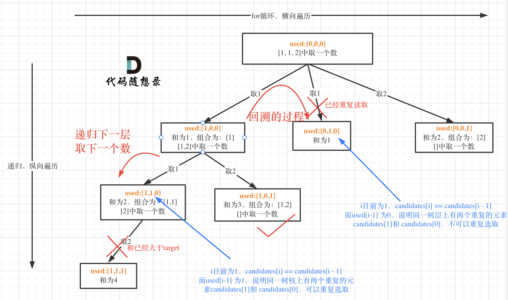

#### [39. Combination Sum](https://leetcode.com/problems/combination-sum/description/)
题目链接/文章讲解：https://programmercarl.com/0039.%E7%BB%84%E5%90%88%E6%80%BB%E5%92%8C.html 
视频讲解：https://www.bilibili.com/video/BV1KT4y1M7HJ  

本题是 集合里元素可以用无数次，那么和组合问题的差别 其实仅在于 startIndex上的控制
本题没有 0（不然会死循环），list 里面的元素都是unique的 （这样不需要考虑去重）

需要注意的点是：
- 取第二个数值的时候需要从这个数值的后面取
  - 例如 [2,5,3], 当到了5的时候，下一个循环可用的array 就只能是 [5,3]; 如果还把2带上，会得到一个重复的组合。组合是无序的， {2,5} & {5,2} 都是一样的。使用 startIndex 来 keep track

递归函数参数
- startIndex 来控制 for loop 的起始位置 
- path

递归终止条件
- 当 sum > target 或者 sum == target 的时候

单层搜索逻辑
- 单层for循环依然是从startIndex开始，搜索candidates集合
- 这个 for loop里面的回溯参数需要放入 for loop 里的 i 而不是 startIndex, 这样才能确保回溯的这个函数还能从头开始(重复选取)

**剪枝优化**
- 在求和问题中，排序之后加剪枝是常见的套路！
- 还没优化前用 sum > target 来判断，其实还是进入了下一层的递归。但如果提前知道 sum > target, 就没有必要进入下一层了。可以在 for loop 中判断

时间复杂度: O(n * 2^n)，注意这只是复杂度的上界，因为剪枝的存在，真实的时间复杂度远小于此
空间复杂度: O(target)

#### [40. Combination Sum II](https://leetcode.com/problems/combination-sum-ii/)
题目链接/文章讲解：https://programmercarl.com/0040.%E7%BB%84%E5%90%88%E6%80%BB%E5%92%8CII.html   
视频讲解：https://www.bilibili.com/video/BV12V4y1V73A

这题相比于之前的回溯题目，array 里面不仅有重复元素，res里的combination 也不能重复--> 需要去重

要去重的是同一树层上的“使用过”（在同一树枝下就已经用过的了），同一树枝上的都是一个组合里的元素，不用去重。树层去重的话，需要对数组排序！

根据我的 code, 有几处可以优化的地方：
- 创建一个 target_score 来每次减去当前的 candidate，这样就不用每次都用 sum(path) 来计算了
- 当目前 candidate 比 target_score 还要大的时候，可以直接 break （这个时候再减下去就会 < 0 了）
- 数层去重：
  - 防止 index 出现负数，需要 ` i > startIndex`
  - 遍历如果和前一个元素相同 `candidates[i] == candidates[i-1]`,做去重的逻辑
  - 需要用排序之后的数组做出去重

时间复杂度: O(n * 2^n)
空间复杂度: O(n)

#### [131. Palindrome Partitioning](https://leetcode.com/problems/palindrome-partitioning/)
https://programmercarl.com/0131.%E5%88%86%E5%89%B2%E5%9B%9E%E6%96%87%E4%B8%B2.html  
视频讲解：https://www.bilibili.com/video/BV1c54y1e7k6  

这道题如何使用 startIndex 来表示切割线算是一个难点。一开始我在 for loop 下面 initialize 了 curr_substring = "", 但这样子会导致每次 for 循环都会从头开始
其实在每个 for loop 下面只要用 s[startIndex:i+1] 就能得到想要的 substring 了

递归函数参数
- startIndex，因为切割过的地方，不能重复切割，和组合问题也是保持一致的

终止条件
- 当 startIndex (起始位置) > len(s) 就可以把目前的 path 放进去 res 里面了

单层搜索逻辑
- 在 `for i in range(startIndex, len(s)):` 循环中，定义了起始位置startIndex，那么 [startIndex, i+1] 就是要截取的子串。startIndex 是不变的开头，只有 i 在改变string的结尾
- 切割过的位置，不能重复切割，所以传入下一层的起始位置为i + 1

时间复杂度: O(n * 2^n)
空间复杂度: O(n^2)
