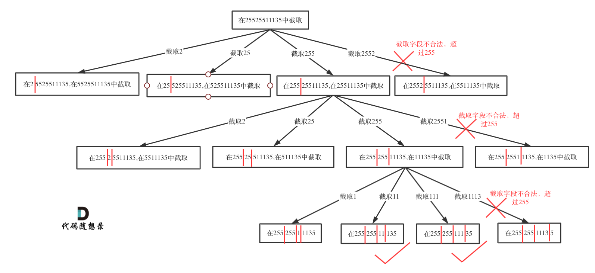

#### [93. Restore IP Addresses](https://leetcode.com/problems/restore-ip-addresses/)
题目链接/文章讲解：https://programmercarl.com/0093.%E5%A4%8D%E5%8E%9FIP%E5%9C%B0%E5%9D%80.html  
视频讲解：https://www.bilibili.com/video/BV1XP4y1U73i/

做完上一题 131 之后再来做这道题，发现整体思路其实差不多，都是切割问题。除了 edge cases 不一样以外，其他都很相像。

递归参数
- startIndex，因为不能重复分割，记录下一层递归分割的起始位置
- 我用了 path 来记录目前用到的元素有多少，方便之后超过4个元素之后可以剪枝

终止条件
- 本题明确要求只会分成4段，所以不能用切割线切到最后作为终止条件，而是分割的段数作为终止条件
  - 当 path 元素超过4个
  - 当 startIndex 等于 s length, 但是 path 元素还是 < 4 的时候

单层遍历逻辑
- [startIndex, i] 这个区间就是截取的子串，需要判断这个子串是否合法
- 如果合法，就与 131 这道题一样了

时间复杂度: O(3^4)，IP地址最多包含4个数字，每个数字最多有3种可能的分割方式，则搜索树的最大深度为4，每个节点最多有3个子节点。
空间复杂度: O(n)

#### [78. Subsets](https://leetcode.com/problems/subsets/)
题目链接/文章讲解：https://programmercarl.com/0078.%E5%AD%90%E9%9B%86.html  
视频讲解：https://www.bilibili.com/video/BV1U84y1q7Ci 

这题是子集，与之前所做的题目不同的地方在于需要收集树的所有节点

- 子集问题 - 无序的集合（取过的元素不会重复取， for 从 startIndex 开始，而不是从0 开始）
  - 求取子集问题，不需要任何剪枝！因为子集就是要遍历整棵树
  - 找树的所有节点

- 排列问题 - 有序的集合（for loop 从 0 开始）
- 组合问题、分割问题 - 收集树的叶子节点

时间复杂度: O(n * 2^n)
空间复杂度: O(n)

#### [90. Subsets II](https://leetcode.com/problems/subsets-ii/)
题目链接/文章讲解：https://programmercarl.com/0090.%E5%AD%90%E9%9B%86II.html   
视频讲解：https://www.bilibili.com/video/BV1vm4y1F71J

这道题是 40 & 78 的结合，但是我在单层循环 for loop 里面搞混淆了用 `continue` 还是 `break`

`continue` - 跳过目前的 iteration 但是这个 loop 还是会继续下一个 iteration的
  - 因为是只想跳过重复的子集, 而不是重复元素之后的所有元素 

`break` - 暂停整个 loop 

`i > startIndex` 是在树层去重，就是如果同一层有重复的，就 continue 跳过这一层。startIndex 相当于这一层的层数，i 相当于往右边的第几个