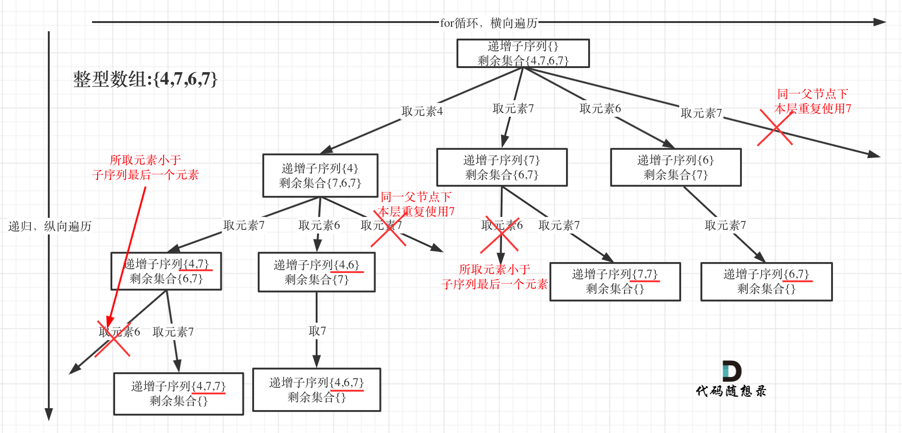

#### [491. Non-decreasing Subsequences](https://leetcode.com/problems/non-decreasing-subsequences/)
https://programmercarl.com/0491.%E9%80%92%E5%A2%9E%E5%AD%90%E5%BA%8F%E5%88%97.html 
视频讲解：https://www.bilibili.com/video/BV1EG4y1h78v  

而本题求自增子序列，是不能对原数组进行排序的，就是不能用 `nums.sort()` 因为排完序的数组都是自增子序列了。所以不能使用之前的去重逻辑！

递归函数参数
- startIndex, path

终止条件
- 当 path 大小至少为 2， 可以加入 res

单层搜索逻辑
- 同一树层上使用过的元素不能再使用了，用 set 来记录用过的元素。这个 set 只负责本层，新的一层这个 set 会清空

时间复杂度: O(n * 2^n)
空间复杂度: O(n)

#### [46. Permutations](https://leetcode.com/problems/permutations/)
https://programmercarl.com/0046.%E5%85%A8%E6%8E%92%E5%88%97.html   
视频讲解：https://www.bilibili.com/video/BV19v4y1S79W   

本题强调没有重复元素，所以不需要去重的操作

排列 - 顺序不同就是两个组合
子集、组合 - 顺序不同也是一个组合

单层搜素逻辑：
- 看看目前 iterate 的元素是否已经在 used 数组中用过，如果没有，就可以append进行dfs操作

时间复杂度: O(n!) - (since each level has n - k choices, k is the current depth of recursion)
空间复杂度: O(n)

#### [47. Permutations II](https://leetcode.com/problems/permutations-ii/)
https://programmercarl.com/0047.%E5%85%A8%E6%8E%92%E5%88%97II.html     
视频讲解：https://www.bilibili.com/video/BV1R84y1i7Tm

这题如果给 nums 排序的话，就可以用 `nums[i] == nums[i-1]` 来确定有没有重复元素
如果不给 nums 排序的话，可以用 set 来去重

时间复杂度: O(n! * n)
空间复杂度: O(n)

#### [51. N-Queens](https://leetcode.com/problems/n-queens/)

https://programmercarl.com/0037.%E8%A7%A3%E6%95%B0%E7%8B%AC.html   
视频讲解：https://www.bilibili.com/video/BV1TW4y1471V

目前大体思路是：
递归函数参数
- n - 棋盘大小；
- row - 记录当前遍历到棋盘第几层
- chessboard

终止条件
- 当递归到最底层（叶子节点） row == n 的时候，就可以收集了

单层递归逻辑
- 有 helper func 来检验是否 valid
- iterate col `for col in range(n)` 是因为这是针对这一层 row 的每一个 col 看看是否可以加进去；而回溯是进入下一层 row
- 放置皇后 -》 回溯 -》撤退皇后

二刷再做吧

#### [37. Sudoku Solver](https://leetcode.com/problems/sudoku-solver/)
https://programmercarl.com/0037.%E8%A7%A3%E6%95%B0%E7%8B%AC.html   
视频讲解：https://www.bilibili.com/video/BV1TW4y1471V
